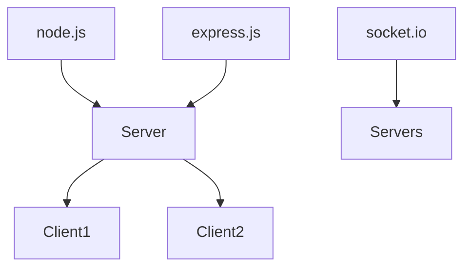
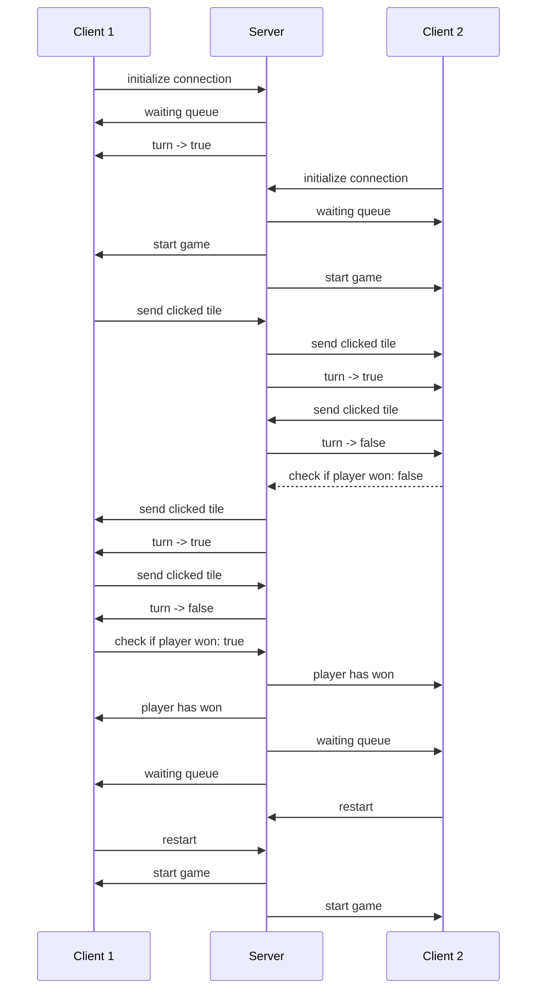

  

# README TicTacToe MP

TicTacToe Multiplayer was developed for studio_UxWebmobile2_2023 at Digital Ideation HSLU. The project is using node.js, express, socket.io, and javascript.

  

## How to play?

Requirements: Node.js

  

1. Download repo

2. Start server in console: "node server.js"

3. Open http://localhost:3000/

4. Play!

  

## Architecture diagram

  

## Sequence diagram

